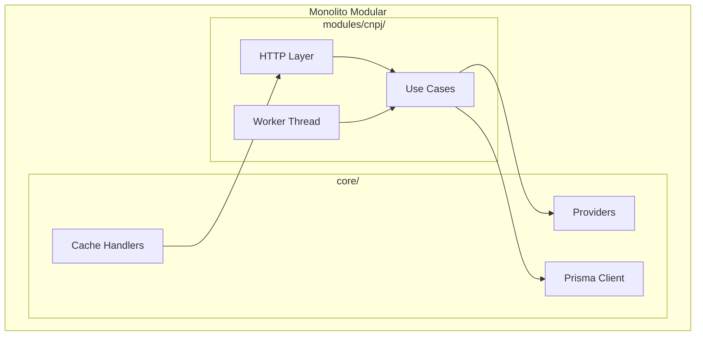
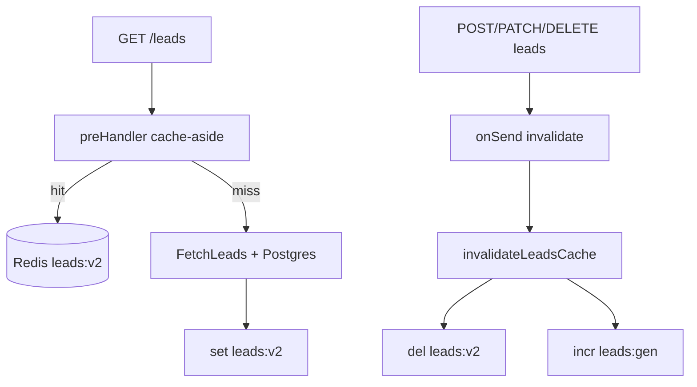
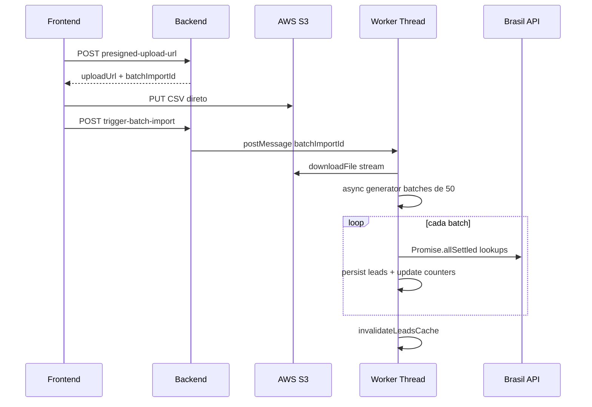
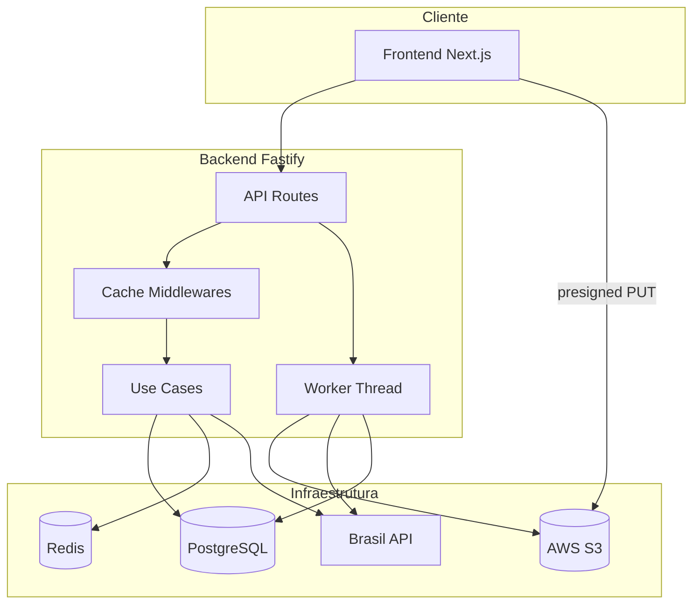

# letalk — Backend (Desafio Técnico)


API backend para consulta e enriquecimento de CNPJs, gestão de leads em pipeline de prospecção e importação em lote via CSV. Integra a [Brasil API](https://brasilapi.com.br/) para dados da Receita Federal, persiste leads enriquecidos no PostgreSQL, utiliza Redis para cache e S3 para upload direto de arquivos.

**Stack:** Fastify 5 · TypeScript · Prisma 7 (adapter pg) · PostgreSQL 17 · Redis 7 · AWS S3 · Brasil API

**Frontend (repo separado):** documentação em [letalk-leads-frontend](https://github.com/guirra-byte/letalk-leads-frontend) · [`README.md`](https://github.com/guirra-byte/letalk-leads-frontend/blob/main/README.md)

---

## Organização do Repositório

Backend e frontend são **repositórios Git separados**:

| Repositório | Conteúdo |
|-------------|----------|
| **Este repo** (`letalk-api`) | API Fastify, worker, Prisma, infra local (Docker), skills do agente |
| **[letalk-leads-frontend](https://github.com/guirra-byte/letalk-leads-frontend)** | Next.js — Kanban, busca CNPJ, importação CSV |

Durante o desafio, cheguei a manter ambos no mesmo workspace para **contextualizar o pair-programming com IA** (Cursor enxerga API e UI juntas). Porém, para versionamento e entrega, o frontend permanece no repo próprio — alinhado ao que seria esperado em ambiente real, onde **CI/CD, releases e ownership** costumam ser independentes por aplicação.

A pasta `frontend/` pode existir localmente ao lado de `backend/` (clone do repo do frontend), mas **não é rastreada** por este repositório (ver `.gitignore` na raiz).

---

## Estrutura do Projeto

```
letalk/
├── .gitignore
├── .agents/skills/              # Skills versionadas para o agente
├── backend/                     # API Fastify + worker + infra local
│   ├── src/
│   ├── prisma/
│   ├── docker-compose.yml
│   ├── .env.example
│   └── README.md                # Documentação (este arquivo)
└── frontend/                    # Clone local (repo separado, gitignored)
```

### Backend

```
backend/
├── src/
│   ├── app.ts / server.ts       # Bootstrap Fastify, CORS, error handler
│   ├── core/                    # Cache, providers (Redis, S3, Brasil API), Prisma
│   └── modules/cnpj/            # HTTP, use-cases, worker de importação
├── prisma/                      # Schema e migrations
├── docker-compose.yml           # Postgres 17 + Redis 7
└── .env.example
```

**Padrão arquitetural (monolito modular):** HTTP → Controller → Factory → Use Case → Providers

Detalhes do frontend (Kanban, React Query, upload CSV) em [letalk-leads-frontend](https://github.com/guirra-byte/letalk-leads-frontend).

---

## Arquitetura — Monolito Modular

O backend adota o padrão de **monolito modular**: um único deploy, com domínios de negócio isolados por pasta e infraestrutura compartilhada. É uma arquitetura com a qual tenho ampla familiaridade — oferece coesão operacional sem a complexidade de microserviços prematuros.

| Camada | Responsabilidade |
|--------|------------------|
| **`core/`** | Infraestrutura compartilhada: providers (Redis, S3, Brasil API), handlers de cache, Prisma, erros de domínio |
| **`modules/cnpj/`** | Bounded context de CNPJ/leads: rotas HTTP, controllers, use-cases, worker de importação, factories |

**Fronteiras:**

- Módulos **não importam** uns aos outros — apenas consomem `core/`
- Novos domínios podem ser adicionados como `modules/<domínio>/` sem alterar o existente
- Fluxo interno de cada módulo: `Routes → Controller → Factory → Use Case → Providers`



---

## Pré-requisitos

- [Node.js](https://nodejs.org/) 20+ (LTS recomendado)
- npm
- [Docker](https://www.docker.com/) e Docker Compose

---

## Instalação e Execução Local

### 1. Instalar dependências

```bash
cd backend
npm install
```

### 2. Configurar variáveis de ambiente

```bash
cp .env.example .env
```

Edite o `.env` com suas credenciais AWS.

### 3. Subir infraestrutura (Postgres + Redis)

```bash
docker compose up -d
```

| Serviço  | Container               | Porta | Credenciais                          |
|----------|-------------------------|-------|--------------------------------------|
| Postgres | `letalk-leads-postgres` | 5432  | db: `letalk-leads`, user/pass: `postgres` |
| Redis    | `letalk-leads-redis`    | 6379  | —                                    |

### 4. Rodar migrations

```bash
npx prisma migrate dev
```

### 5. Iniciar o servidor em desenvolvimento

```bash
npm run start:dev
```

A API estará disponível em **http://localhost:3001**.

Verifique o health check:

```bash
curl http://localhost:3001/api/v1/health
# { "status": true, "message": "Server is running" }
```

### 6. Build para batch import (worker thread)

O worker de importação em lote roda em uma **thread separada** e exige o código compilado:

```bash
npm run build
```

> Em desenvolvimento, execute `npm run build` novamente após alterações no worker (`src/modules/cnpj/services/cnpj-batch-import-worker/`).

### Produção

```bash
npm run build
NODE_ENV=prod npm run start:prod
```

---

## Variáveis de Ambiente

Copie [`.env.example`](.env.example) para `.env`. **Nunca commite o arquivo `.env`** — ele está no `.gitignore`.

| Variável | Obrigatória | Default | Descrição |
|----------|:-----------:|---------|-----------|
| `DATABASE_URL` | sim | — | Connection string PostgreSQL |
| `DB_CONNECTION_LIMIT` | não | `10` | Tamanho máximo do pool de conexões |
| `DB_POOL_TIMEOUT` | não | `10000` | Timeout do pool (ms) |
| `API_PORT` | não | `3001` | Porta da API |
| `FRONTEND_URL` | não | `http://localhost:3000` | Origens CORS (separadas por vírgula) |
| `NODE_ENV` | não | — | `prod` ativa SSL no pool PostgreSQL |
| `REDIS_HOST` | sim | — | Host do Redis |
| `REDIS_PORT` | não | `6379` | Porta do Redis |
| `AWS_S3_REGION` | sim | `us-east-1` | Região do bucket S3 |
| `AWS_S3_BUCKET_NAME` | sim | — | Nome do bucket |
| `AWS_S3_FORCE_PATH_STYLE` | não | `false` | `true`  |
| `AWS_ACCESS_KEY_ID` | condicional | — | Omitir se usar IAM role |
| `AWS_SECRET_ACCESS_KEY` | condicional | — | Omitir se usar IAM role |

**Permissões IAM necessárias** no prefixo `batch-imports/*`: `s3:PutObject`, `s3:GetObject`.

**CORS do bucket** (upload direto do browser):

```
AllowedMethods: PUT, GET, HEAD
AllowedOrigins: http://localhost:3000
AllowedHeaders: *
```

---

## API — Endpoints

Prefixo base: `/api/v1`

| Método | Rota | Descrição |
|--------|------|-----------|
| `GET` | `/health` | Health check |
| `POST` | `/cnpj/lookup` | Consulta CNPJ (Brasil API + cache Redis) |
| `GET` | `/cnpj/leads` | Lista leads (cache-aside) |
| `POST` | `/cnpj/leads` | Persiste lookup em cache como lead |
| `DELETE` | `/cnpj/leads/:leadId` | Remove lead |
| `PATCH` | `/cnpj/leads/:leadId/pipeline-status` | Atualiza status do pipeline |
| `POST` | `/cnpj/batch-imports/presigned-upload-url` | Gera URL presigned para upload S3 |
| `POST` | `/cnpj/trigger-batch-import` | Dispara worker de importação |
| `DELETE` | `/cnpj/batch-imports/:batchImportId` | Cancela importação |

### Query params — `GET /cnpj/leads`

| Param | Tipo | Valores |
|-------|------|---------|
| `pipelineStatus` | enum | `PENDING`, `IN_REVIEW`, `QUALIFIED`, `REJECTED` |
| `priority` | enum | `LOW`, `MEDIUM`, `HIGH` |
| `search` | string | Busca por CNPJ, razão social, nome do lead, etc. |

### Formato CSV para importação em lote

Header **obrigatório**, separador **`;`** (ponto e vírgula):

```
nome;email;telefone;empresa;cnpj
João Silva;joao@email.com;(61) 99999-9999;Empresa XYZ;12345678000199
```

---

## Diferenciais Técnicos (Além dos Requisitos)

As decisões abaixo **não faziam parte do escopo obrigatório**, mas foram adicionadas intencionalmente por valor técnico, performance e demonstração de maturidade em engenharia.

### Cache-aside com middlewares Fastify *(diferencial)*

Para garantir performance e consistência, a aplicação adota a estratégia **Cache-Aside** em dois níveis no Redis (TTL de 15 minutos):



- **Leitura:** `preHandler` em `GET /leads` intercepta a requisição — se houver cache, retorna imediatamente sem tocar no banco.
- **Escrita:** `onSend` em mutações de leads invalida o cache automaticamente após a resposta.
- **Proteção contra race condition:** contador `leads:gen` — se uma invalidação ocorrer durante o fetch do banco, o cache stale não é gravado.
- **Lookup CNPJ:** chave `cnpj-lookup:{cnpj}` evita chamadas repetidas à Brasil API.

**Limitação conhecida:** no cache hit de leads, a lista completa é retornada — filtros (`pipelineStatus`, `priority`, `search`) só são aplicados em cache miss.

---

### Batch import com AsyncGenerator + Worker Thread *(diferencial)*

A importação em lote processa CSVs grandes sem bloquear o event loop da API:



Destaques:

- **AsyncGenerator** consome o stream CSV sob demanda — o arquivo inteiro nunca é carregado em memória.
- Lotes de **50 CNPJs** processados com `Promise.allSettled` — falhas isoladas não abortam o lote.
- **Worker thread** (`worker_threads`) mantém a API responsiva durante importações longas.
- Build dual-entry via `tsup`: `server.js` + `worker.js` compilados separadamente.

---

### Upload S3 com Presigned URLs *(diferencial)*

O frontend faz upload **direto ao S3**, sem passar o arquivo pelo backend:

1. Backend gera URL presigned (`POST /batch-imports/presigned-upload-url`)
2. Frontend faz `PUT` direto no S3
3. Backend dispara o worker que baixa e processa o CSV

- Path no S3: `batch-imports/{uuid}/{filename}`
- Expiração da URL: 24 horas
- Suporte a **AWS real** via `AWS_S3_ENDPOINT` + `AWS_S3_FORCE_PATH_STYLE=true`

---

### Decisões de base *(escopo do desafio)*

| Decisão | Justificativa |
|---------|---------------|
| **Prisma 7 + adapter pg** | Pool PostgreSQL compartilhado; SSL automático em `NODE_ENV=prod` |
| **Validação Zod** | Schemas centralizados com mensagens de erro estruturadas |
| **Graceful shutdown** | SIGINT/SIGTERM/SIGUSR2 fecham conexões antes de encerrar |
| **Factories manuais (`make-*`)** | Injeção de dependência simples, sem container — adequado ao escopo |

### Evolução do escopo *(refinamento)*

| Decisão | Justificativa |
|---------|---------------|
| **Segregação lead vs CNPJ** | `leadName`, `leadEmail`, `leadPhoneNumber` separados dos dados da Receita (`email`, `legalName`) — o contato do lead pode ser diferente do e-mail cadastrado no CNPJ |

### Arquitetura geral



---

## Uso de Inteligência Artificial

Este projeto foi desenvolvido com apoio do **Cursor** como parceiro de pair-programming. A estratégia adotada separa **planejamento** de **execução** — acreditando que a fase de planejamento é a mais crítica do processo de desenvolvimento. As decisões arquiteturais e trade-offs permanecem do autor; a IA atua como acelerador de execução e debugging.

### Estratégia de modelos no Cursor

| Fase | Modelo | Papel |
|------|--------|-------|
| **Planejamento** | **Claude Opus 4.7** | Planos de implementação densos, trade-offs arquiteturais, decomposição de tarefas complexas — etapa considerada a mais importante do processo |
| **Execução** | **Claude Sonnet 4.6** | Implementação de planos aprovados, refatorações estruturadas, debugging |
| **Execução rápida** | **Composer 2.5** | Iterações ágeis, ajustes pontuais, execução de to-dos de planos já definidos |

O Opus 4.7 gera planos de alta qualidade, densidade e coesão; Sonnet e Composer executam esses planos com velocidade, mantendo direção clara e evitando "código solto" sem contexto.

### Skills locais do projeto

Skills baixadas e versionadas **in-repo** em [`.agents/skills/`](../.agents/skills/) servem como contexto persistente de aprendizado para o agente:

- **[`documentation/SKILL.md`](../.agents/skills/documentation/SKILL.md)** — princípios de documentação técnica, tipos de doc (README, API, runbook), estrutura esperada
- Referenciadas nos prompts via `@.agents/skills/documentation/SKILL.md`
- Benefício: resultados mais consistentes entre sessões, independente do histórico do chat

### Técnicas de prompt engineering

Práticas aplicadas ao longo do desenvolvimento:

1. **Persona** — definir o papel do agente antes da tarefa (ex.: *"engenheiro full-stack especializado em workflows"*, *"agente de documentação técnica"*)
2. **Contexto rico** — anexar arquivos relevantes (`@backend/...`, `@frontend/...`, `@docker-compose.yml`), convenções existentes e lógica de negócio
3. **Modelos de implementação** — referenciar código existente como padrão (*"mantenha minha lógica"*, *"siga o estilo de `make-*` factories"*)
4. **Resultado claro** — objetivo explícito, critérios de aceite, escopo delimitado (*"apenas alterações necessárias"*, *"evitar over-engineering"*)
5. **Guardrails** — restrições no prompt: preservar arquitetura, evitar abstrações prematuras, não alterar arquivos não relacionados, seguir plano anexado sem editá-lo

> Exemplo real: *"Pensando como meu parceiro de pair-programming, precisamos ser coesos, simples e ágeis. Preserve a arquitetura atual, evite overengineering, faça apenas as alterações necessárias."*

### O que a IA executou

| Área | Como a IA ajudou |
|------|------------------|
| **Pair-programming full-stack** | Refatoração para segregar dados de lead vs CNPJ, migrations Prisma, serializers |
| **Debug de batch import** | Correção do bug do `yield` em arquivos com menos de 50 linhas; preset fixo de headers CSV (`nome;email;telefone;empresa;cnpj`) |
| **Erro Prisma** | Diagnóstico e fix do `Unknown argument partners` na persistência em lote |
| **Cache/concorrência** | Correção de inconsistência no kanban (`leadName` ausente); alinhamento de invalidação de cache |
| **Configuração AWS/S3** | Aceleração na config de presigned URLs, CORS e variáveis AWS |
| **Otimização de configuração** | Setup rápido de Docker Compose, Prisma adapter pg, tsup dual-entry para worker |
| **Documentação** | Estruturação e mapeamento arquitetural deste README |

---

## Tempo Gasto

**~16 horas (~2 dias de trabalho)**

| Fase | Tempo estimado |
|------|----------------|
| Setup infra (Docker, Prisma, Redis, S3) | ~3h |
| Core API (lookup, leads, cache-aside) | ~5h |
| Batch import + worker + presigned URLs | ~5h |
| Refatorações e correções (lead fields, CSV, cache) | ~3h |

---

## Com Mais Tempo, O Que Faria

Prioridades na ordem de impacto:

### 1. Rate limiter da Brasil API (primeira prioridade)

A Brasil API possui limites de requisição. Em importações grandes, chamadas paralelas podem resultar em HTTP 429. Implementaria uma fila com **backoff exponencial** e throttle configurável para respeitar os limites sem sacrificar throughput.

### 2. Dashboard de importação com SSE

Um endpoint **Server-Sent Events** emitindo progresso em tempo real (`processedCnpjCount`, `failedCnpjCount`, `status`) — permitindo um dashboard enxuto para acompanhar importações sem polling.

### 3. Heurísticas de priorização na importação

Scoring automático com sinais já disponíveis no lookup da Receita:

| Sinal | Campo | Uso |
|-------|-------|-----|
| Tempo de operação | `foundedAt` | Empresas mais antigas → maior score |
| Capital social | `capitalSocial` | Threshold para qualificação |
| Número de sócios | `partners.length` | Proxy de maturidade |
| CNAEs secundários | `secondaryActivities.length` | Diversificação de atividade |

Resultado: definição automática de `pipelineStatus` (`QUALIFIED` / `REJECTED`) e `priority` (`LOW` / `MEDIUM` / `HIGH`) — hoje fixo em `PENDING` + `LOW` na importação.

---

Projeto desenvolvido com dedicação.

Contato: guirramatheus1@gmail.com | [LinkedIn](https://linkedin.com/in/guirra-byte) | +55 (61) 99283-9756
